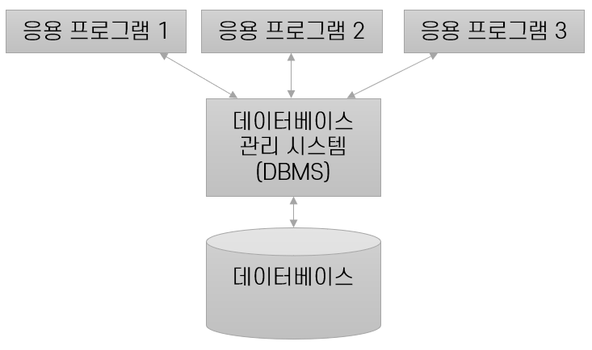

= Database Management System(데이터베이스 관리 시스템)

* 데이터의 방대한 집합체를 유지, 관리하고 이용하는데 설계된 소프트웨어

* 통합 저장된 운영 데이터로서의 특징
. *Real-time Accessibility : 실시간 접근성* +
데이터베이스는 임의적이고 비정형적인 질의에 대해 실시간으로 응답할 수 있어야한다. +
이는 온라인 처리와 동일한 의미로 사용된다.

. *Continuous Evolution : 지속적인 변화* +
어느 한 시점에 데이터 베이스가 젖아하고 있는 내용은 곧 데이터베이스의 상태를 의미한다.
이는 데이터베이스의 상태는 동적으로 변화한다는 것을 의미하며, +
Insertion(삽입), Deletion(삭제), Update(갱신)으로 항상 변화한다.

. *Concurrency Sharing : 동시 사용* +
여러 사용자가 동시에 원하는 데이터에 접근 할 수 있어야 한다. +
특히 같은 내용의 데이터를 여러 사용자가 공유할 때의 관리가 중요하다.

. *Content Reference : 내용 참조* +
데이터의 참조는 레코드의 주소나 위치에 의해서가 아니라, 요구하는 데이터의 내용(데이터가 가지고 있는 값)에 참조된다.

== 기능

* Data Definition (데이터 정의) 기능
. 데이터 정의는 데이터 모델과 데이터 베이스를 물리적 저장 장치에 저장하는 명세를 포함한다.
. 논리 구조와 물리 구족의 Mapping을 명세

* Data Manipulation (데이터 조작) 기능
. 사용자와 데이터베이스 사이의 인터페이스를 위한 수단을 제공한다.
. 사용 하기 쉽고, 자연스러워야 하며, 명확하고 완전 해야 한다.
. 공용 데이터라고 접근이나 처리가 비효율적이어여선 안된다.

* Data Control(데이터 제어) 기능
. 데이터의 갱신, 삽입, 삭제 작업이 정확하며 무결성을 제공함.

link:04_data_model.adoc[다음 : Data Model]