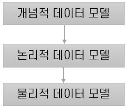

= 데이터 모델

== DBMS의 데이터 명세 및 저장

* DBMS는 저장될 데이터를 데이터 모델 형식으로 정의한다.

* 데이터 모델
** 디스크 수준에서 데이터 저장 내역을 감추고, 높은 수준으로 추상화하여 데이터를 명세한다.
** 데이터의 관계, 접근과 그 흐름의 처리과정에 관한 추상화 모형
** 현실 세계의 정보를 컴퓨터로 표현하기 위하여 단순화, 추상화 하여 표현
** DBMS의 데이터 저장 방식과 실제 세계의 간극을 좁히기 위해 데이터 모델을 사용

[.text-center]

== 데이터 모델의 종류

. *Structured Data* +
파일 또는 기록 내의 고정 필드에 있는 데이터를 의미하며, 숫자, 텍스트로 구성된다.

. *Unstructured Data* +
사전에 정의된 방식으로 구조화되지 않은 데이터를 의미하며, 데이터 모델이 정해지지 ㅇ낳아서 기본 형식으로 저장된다.
보통 텍스트, SNS활동, 이미지 등이 있다.

. *Semi-Structured Data* +
Relation Databse의 구조에 맞지 않지만, Tag나 Marker, Bucket를 활용하여 검색을 할 수 있다. +
테이블이나 배열보다는 트리와 그래프와 유사하다.

. *Relational Data Model* +
술어 논리와 집합론에 기반을 둔 데이터 베이스 모델.
Entity와 Entity 사이의 관계로 데이터를 표현하며, 논리적 데이터베이스 모델 중 가장 널리 사용된다.

link:05_data_independency.adoc[다음 : 데이터 독립성]