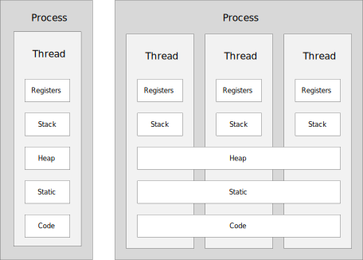
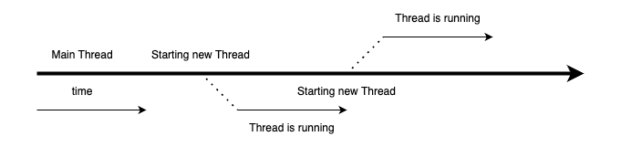

= Process vs Thread

[.text-center]
 +
프로세스와 쓰레드

== Process(프로세스)
* 실행중인 프로그램을 의미한다
* CPU의 스케줄링의 대상이 되는 작업(task)와 같은 의미로 사용된다.
* Storage의 프로그램을 실행하면 실행을 위해서 메모리 할당이 이루어지고, 이 공간으로 바이너리 코드가 올라간다
** 이 순간부터 *_process_* 라고 부른다.
* process는 하나 이상의 Thread 구성이 된다.

== Thread(스레드)
* process와 유사하지만 메모리의 많은 부분을 공유한다.
* Thread별로 Stack과 Register를 갖고 있다.
* Thread of Control을 줄인 말로, 제어의 흐름을 시각적으로 표현하면 아래와 같다.

[.text-center]

== Process와 Thread의 차이

[cols=2*, options=header]
|===

|Process
|Thread

|프로그램이 실행되기 위한 모든 자원들을 개별적으로 가지고 있어 무겁다.
|개별적으로 분리가 필요한 최소한의 자원들만 가지고 있다. LWP(Light Weight Process)라고도 하는 경량 Process.

|Process 별로 자체 메모리를 갖는다.
|Process 내의 다른 Thread와 메모리를 공유한다.

|개별 메모리로 인해 prcess 간 통신이 느리다

Process간의 통신을 위해서는 OS에서 제공하는 통신 기술을 활용해야 한다.
|공유 메모리를 이용하여 직접 통신이 가능하여, Thread간 통신이 빠르다.

|Multi process 지원 시스템에서는 process context switching
footnote:[https://www.geeksforgeeks.org/context-switch-in-operating-system/[Context switch in operating system]]시 이전 process의 메모리 및 스택 정보를 storage에 저장하는 swapping
footnote:[https://www.geeksforgeeks.org/swapping-in-operating-system[Swapping in operating system]]이 발생할 수 있으며, 이는 메모리에 있던 정보르 storage에 옮기거나 storage에 저장된 정보를 메모리에 올리는 작업이 수행되므로 비용이 많이 든다
|thread 간 context 전환은 공유 메모리로 인해 비용이 저렴하다.

|구성 요소에 대한 여러 Process가 있는 경우 Application은 메모리가 부족할 때 더 나은 메모리 활용도를 제공할 수 있다.

Application의 비활성 process에 낮은 우선순위를 할당할 수 있다. 그러면 유휴 Processsms Storage로 Swapping
footnote:[https://www.baeldung.com/linux/find-swap-memory-usage-by-processes[Find Swap Memory Usage by Processes in Linux]] 될 수 있다.
|메모리가 부족한 경우, Multi-Threaded Application은 메모리 관리를 위한 어떠한 방법도 제공하지 않는다.
|===

== Single Thread
* Main 스레드 하나에서 작업을 진행한다. 작업은 순차적으로 진행된다.
* 하나의 프로세스에서 오직 하나의 스레드만 실행한다.
** 단일 레지스터와 스택으로 구성된다.
** Context Switching 작업을 요구하지 않는다.
** 동시성 제어에 대한 처리를 신경쓰지 않아도 된다.

== Multi Thread
* 프로그램 내에서 두 개 이상의 동작을 동시에 실행한다.
** 프로세스의 활동을 극대화한다.
** 두 개가 동작을 동시에 실행한다.
* 하나의 프로세스를 다수의 실행 단위로 구분하여 자원을 공유한다.
** 자원의 생성과 관리의 중복성 최소화
** 수행 능력 향상

link:2_context.adoc[다음 : Context]