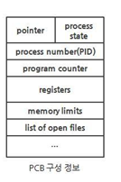

= Context

== 프로세스에서의 Context

* Process Context는 프로세스가 현재 어떤 상태에서 수행되고 있는지를 적어둔 정보이다.
* 현대의 운영체제는 Time-Shared(시분할 기법)을 사용하고 있다. 시분할 환경에서는 Timer Interrupt에 의해 짧은 시간 CPU를 점유하고, 다른 프로세스에게 넘겨주고 순서를 기다린다.
이 때, 다시 명령을 수행하려면 어디까지 명령을 수행했는 지에 대한 정확한 수행 시점과 상태를 재현할 수 있는 정보가 필요하다. +
이 정보가 바로 Process Context이다.

== Process Context
* Hardware Context : CPU의 수행 상태를 나타내는 것으로, Program Counter와 각족 레지스터에 저장하고 있는 값을 의미
* 프로세스의 주소공간 : 코드, 데이터, 스택으로 이뤄진 프로세스만으로 이뤄진 독자적 주소 공간
* 커널 상의 Context : 자료구조 PCB(Process Control Block)과 Kernel Stack(커널 내 주소)를 의미

[.text-center]

== Context Switch

* 프로세스 A에서 프로세스 B로 넘어갈 때 발생하나, 반드시 일어나는 것은 아니다.
* CPU를 내어주는 프로세스의 Context를 그 프로세스의 PCB에 저장
* CPU를 새롭게 얻는 프로세스의 Context를 PCB로부터 읽어 하드웨어로 복원

