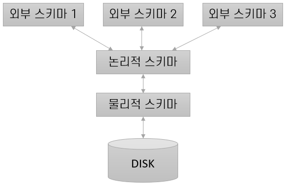

= 데이터 독립성

* *DBMS는 3단계의 추상화로 표현된다*

[.text-center]

* *Scheme(스키마)* +
데이터베이스의 자료의 구조와 자료의 표현 방법, 자료 간의 관계와 제약 조건을 형식 언어로 정의한 구조이다. +
스키마는 Entity(개체), 개체의 특성인 Attribute(속성), 개체 사이의 Relation(관계), 그리고 이들이 유지해야하는 Constraint(제약 조건)이 있다. +

. *외부 스키마* +
각각의 사용자 수준에서 데이터 접근을 개별화 하기 위해 분리한 스키마. +
모든 데이터를 저장하는 테이블은 하나이기 때문에, 같은 물리적 스키마를 기반으로 외부 스키마를 만들어 외부 사용자가 필요한 데이터만을 사용할 수 있도록 분리하는 것을 의미한다.
보통 View(뷰)로 만들어진다.
. *논리적 스키마* +
Conceptual Schema(개념 스키마)라고도 부르며, 해당 DBMS의 데이터 모델이 저장될 데이터를 기술하는 스키마이다. +
데이터베이스에 저장될 모든 테이블에 대한 명세 정보가 담겨 있다. +
ex) +
`상품 분류 -> 분류번호 : 정수, 분류이름 : 문자열` +
`상품 -> 상품번호 : 정수, 모델번호 : 문자열, 상품가격 : 실수` +
개념 스키마는 설계한 테이블이 어떤 자료구조를 사용하여 저장할 지에 대해서는 고려하지 않는다. +

. *물리적 스키마* +
사용할 조직과 검색을 위한 인덱스 등의 저장 내역을 담고 있다.
물리적 스키마는 개념 스키마에 명세된 테이블들이 디스크에 어떻게 저장될 지를 요약한다. +
ex) 개념스키마가 아래와 같이 짜여져있다면, +
`학생(학번 : 정수, 이름 : 문자열, 전자메일 : 문자열, 나이 : 정수, 학점 : 실수)` +

[source,sql]
CREATE TABLE [학생] (
[학번]		int,
[이름]		nvarchar(12)		NOT NULL,
[전자메일]	varchar(30)		    NULL,
[나이]		int			        NOT NULL,
[학점]		decimal(2,1)		NOT NULL
)

link:06_database_query.adoc[다음 : Query와 동시접근, 복구]